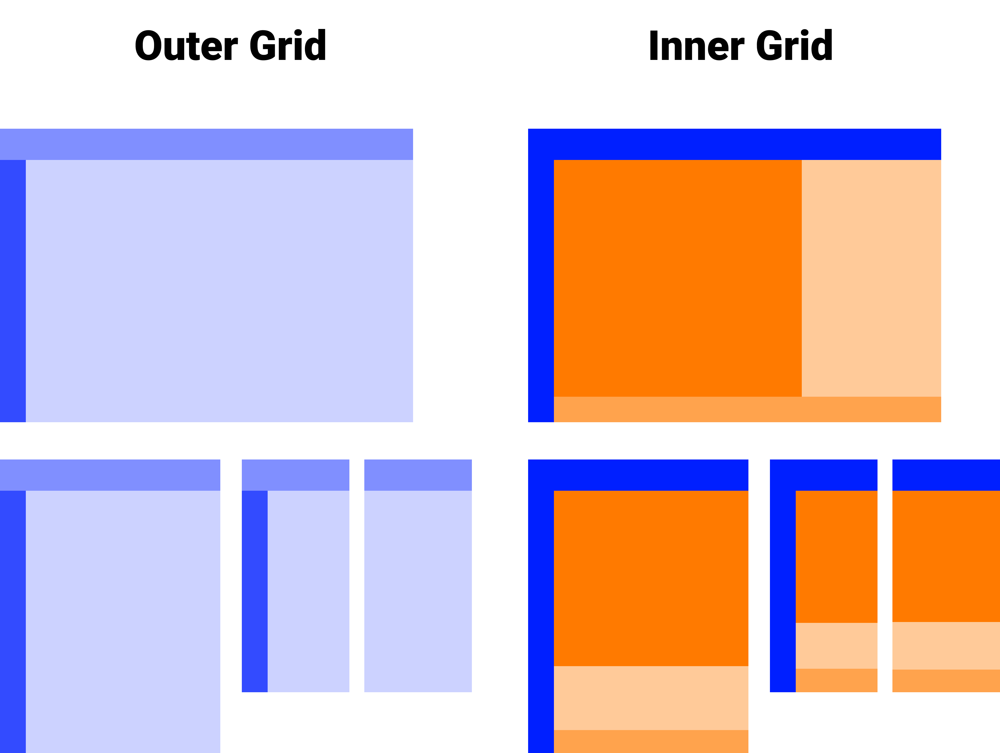

See [this link](https://zachgoll.github.io/holy-grail-css-layout/) for the completed project.  I recommend keeping this open so you can look at the visual design as you build.

## Colors

- Header / Footer Background Color - #1e4040
- Text/Icon Color - #1e4040
- Link text color - #71d99e

### Layout "frame" colors

To help you visualize the CSS Grid containers, I use the following colors in the tutorial:



When you are first starting the project, I suggest using these colors to help you visualize the containers.  **Once you have created them, you will remove these colors from the design.**  There is no particular significance to these colors.  I picked them arbitrarily.

- Outer Grid
    - Outer grid header - rgba(0, 31, 255, 0.5)
    - Outer grid navbar - rgba(0, 31, 255, 0.8)
    - Outer grid main area - rgba(0, 31, 255, 0.2)
- Inner Grid
    - rgba(255, 122, 0)
    - rgba(255, 122, 0, 0.4)
    - rgba(255, 122, 0, 0.7)

## Fonts and Icons

The font for this webpage is [Dosis](https://fonts.google.com/specimen/Dosis) with weights of 400 and 700.

We are using the [Font Awesome](https://fontawesome.com/) icon set.  You can find the [CDN link here](https://cdnjs.com/libraries/font-awesome).

Here are the icons you will need:

- [Header menu](https://fontawesome.com/icons/bars?style=solid)
- [Header video](https://fontawesome.com/icons/youtube?style=brands)
- [Header paragraph](https://fontawesome.com/icons/paragraph?style=solid)
- [Navbar home](https://fontawesome.com/icons/home?style=solid)
- [Navbar profile](https://fontawesome.com/icons/user?style=solid)
- [Navbar billing](https://fontawesome.com/icons/dollar-sign?style=solid)

## Pictures

All images are randomized with the following structure:

```html

```

To avoid duplicates, increment `random=1` to `random=2`, `random=3`, etc.